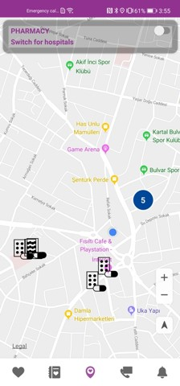

# Pregnancy Tracker

    

A Pregnancy Tracker application to demonstrate the best practices of Huawei ML Kit, Account Kit, Map Kit, Location Kit, Site Kit, Image Kit, Push Kit, Panorama Kit, IAP, Remote Configuration, Analytics Kit and Crash Service.

  

## Introduction

Pregnancy Tracker is a reference application for HMS kits for phones running with the android-based HMS service. 
Purpose of application is make to easy pregnancy period and assist them. 
Users can follow their pregnancy period and get information about weeks, find nearby hospital and pharmacies, track their mood.
They can edit their image and display the ultrasounic view in 3D areas. 
The contacts can be added and send the location to contacts in emergency situation. 

## Huawei ML Kit

HUAWEI ML Kit allows your apps to easily leverage Huawei's long-term proven expertise in machine learning to support diverse artificial intelligence (AI) applications throughout a wide range of industries. Thanks to Huawei's technology accumulation, ML Kit provides diversified leading machine learning capabilities that are easy to use, helping you develop various AI apps. For more information: [**ML Kit**](https://developer.huawei.com/consumer/en/hms/huawei-mlkit/)

## Huawei Account Kit

Account Kit provides you with simple, secure, and quick sign-in and authorization functions. Instead of entering accounts and passwords and waiting for authentication, users can just tap the Sign in with HUAWEI ID button to quickly and securely sign in to your app with their HUAWEI IDs. For more information: [**Account Kit**](https://developer.huawei.com/consumer/en/hms/huawei-accountkit/)

## Huawei Map Kit

Map Kit is an SDK for map development. It covers map data of more than 200 countries and regions, and supports over one hundred of languages. With this SDK, you can easily integrate map-based functions into your apps. In addition, Map Kit continuously optimizes and enriches the map detail display capability. For example, Map Kit can clearly show green fields and vegetation information in a small scale. It can also display most suitable POIs and road network information in different scales based on the POI attributes and regional road network differences. Map Kit supports gestures including zoom, rotation, moving, and tilt gestures to ensure smooth interaction experience For more information: [**Map Kit**](https://developer.huawei.com/consumer/en/hms/huawei-MapKit/)

## Huawei Location Kit

Location Kit combines the Global Navigation Satellite System (GNSS), Wi-Fi, and base station location functionalities into your app to build up global positioning capabilities, allowing you to provide flexible location-based services for global users. Currently, it provides three main capabilities: fused location, activity identification, and geofence. You can call one or more of these capabilities as needed. For more information: [**Location Kit**](https://developer.huawei.com/consumer/en/hms/huawei-locationkit/)

## Huawei Site Kit

Site Kit provides place search services including keyword search, nearby place search, place detail search, and place search suggestion, helping your app provide convenient place-related services to attract more users and improve user loyalty. In the future, Site Kit will support place search in 44 languages, and continuously enrich POI data to provide more scenario-specific search results in scenarios such as airport and railway station searches. It will continuously provide you with rich, powerful, and convenient search services. For more information: [**Site Kit**](https://developer.huawei.com/consumer/en/hms/huawei-sitekit/)

## Huawei Image Kit

HUAWEI Image Kit incorporates smart image editing and design as well as animation capabilities into your app, giving it the power of efficient image content reproduction while providing a better image editing experience for your users. For more information: [**Image Kit**](https://developer.huawei.com/consumer/en/hms/huawei-imagekit/)

## Huawei Push Kit

HUAWEI Push Kit is a messaging service provided for you. It establishes a messaging channel from the cloud to devices. By integrating Push Kit, you can send messages to your apps on users' devices in real time. This helps you maintain closer ties with users and increases user awareness of and engagement with your apps. The following figure shows the process of sending messages from the cloud to devices. For more information: [**Push Kit**](https://developer.huawei.com/consumer/en/hms/huawei-pushkit/)

## Huawei Panorama Kit

By integrating the SDK of HUAWEI Panorama Kit, your app can quickly display interactive viewing of 360-degree spherical or cylindrical panoramic images in simulated 3D space on Android phones, delivering an immersive experience to users. With Panorama Kit, panorama-related services are attainable with the least coding. For more information: [**Panorama Kit**](https://developer.huawei.com/consumer/en/hms/huawei-panoramakit/)

## Huawei IAP

IAP provides convenient in-app payment experience, which helps you boost monetization. Users can purchase a variety of virtual products, including one-time virtual products and subscriptions, directly within your app. For more information: [**IAP**](https://developer.huawei.com/consumer/en/hms/huawei-iap/)

## Huawei Remote Configuration

AppGallery Connect Remote Configuration allows you to change the behavior and appearance of your app online without requiring users to update the app. With the service, you can provide tailored experience for your users in a timely manner. For more information: [**Remote Configuration**](https://developer.huawei.com/consumer/en/agconnect/remote-configuration/)

## Huawei Analytics Kit

HUAWEI Analytics Kit (hereinafter referred to as Analytics Kit or Kit) offers a rich array of preset analytics models that help you gain an in-depth insight into your users, products, and content. With this insight, you can then take a data-driven approach to make informed decisions for product and marketing optimizations. For more information: [**Analytics Kit**](https://developer.huawei.com/consumer/en/hms/huawei-analyticskit)

## Huawei Crash Service

The AppGallery Connect Crash service provides a powerful yet lightweight solution to app crash problems. With the service, you can quickly detect, locate, and resolve app crashes (unexpected exits of apps), and have access to highly readable crash reports in real time, without the need to write any code.
To ensure stable running of your app and prevent user experience deterioration caused by crashes, it is key to monitor the running status of your app on each device. For more information: [**Crash Service**](https://developer.huawei.com/consumer/en/doc/development/AppGallery-connect-Guides/agc-crash-introduction)

## What You Will Need

**Hardware Requirements**
- A computer that can run Android Studio.
- A Huawei phone for debugging.

**Software Requirements**
- Android SDK package
- Android Studio 3.X-4.X
- HMS Core (APK) 4.X or later

## Getting Started

Pregnancy Tracker app uses HUAWEI services. In order to use them, you have to [create an app](https://developer.huawei.com/consumer/en/doc/distribution/app/agc-create_app) first. Before getting started, please [sign-up](https://id1.cloud.huawei.com/CAS/portal/userRegister/regbyemail.html?service=https%3A%2F%2Foauth-login1.cloud.huawei.com%2Foauth2%2Fv2%2Flogin%3Faccess_type%3Doffline%26client_id%3D6099200%26display%3Dpage%26flowID%3D6d751ab7-28c0-403c-a7a8-6fc07681a45d%26h%3D1603370512.3540%26lang%3Den-us%26redirect_uri%3Dhttps%253A%252F%252Fdeveloper.huawei.com%252Fconsumer%252Fen%252Flogin%252Fhtml%252FhandleLogin.html%26response_type%3Dcode%26scope%3Dopenid%2Bhttps%253A%252F%252Fwww.huawei.com%252Fauth%252Faccount%252Fcountry%2Bhttps%253A%252F%252Fwww.huawei.com%252Fauth%252Faccount%252Fbase.profile%26v%3D9f7b3af3ae56ae58c5cb23a5c1ff5af7d91720cea9a897be58cff23593e8c1ed&loginUrl=https%3A%2F%2Fid1.cloud.huawei.com%3A443%2FCAS%2Fportal%2FloginAuth.html&clientID=6099200&lang=en-us&display=page&loginChannel=89000060&reqClientType=89) for a HUAWEI developer account.

After creating the application, you need to [generate a signing certificate fingerprint](https://developer.huawei.com/consumer/en/codelab/HMSPreparation/index.html#3). Then you have to set this fingerprint to the application you created in AppGallery Connect.
- Go to "My Projects" in AppGallery Connect.
- Find your project from the project list and click the app on the project card.
- On the Project Setting page, set SHA-256 certificate fingerprint to the SHA-256 fingerprint you've generated.

## Using the application

- Before you run the app, make sure that you have a working internet connection since the application uses Huawei Mobile Services. Otherwise, the app will not be able to perform the security checks only after which you can use the app.

A login screen will welcome you at the first opening of the application. When you log in with Huawei ID, the date selection screen will appear. According to your selection, We calculate how many weeks and months your baby is. When you allow us to take your location, we show you the nearest hospital and pharmacies on a map. You can call directly from the application using its number of pharmacies and hospitals or you can start direction from your own location on the Petal Map.You can add diary for your baby in the application. Add to this diary what mode you are in You can do it. You can upload and edit photos. You can see your child's ultrasound for a certain fee in 3D space. You can send your location directly to that number as a message. You can receive notifications if you want to join notification channels. You can add contact number for emergency situations and send your location.

## Screenshots

 

  

  

  

 

## Project Structure

Pregnancy Tracker app is designed with MVVM design pattern.

## Libraries

 - Huawei ML Kit
 - Huawei Account Kit
 - Huawei Map Kit
 - Huawei Location Kit
 - Huawei Site Kit
 - Huawei Image Kit
 - Huawei Push Kit
 - Huawei Panorama Kit
 - Huawei IAP
 - Huawei Remote Configuration
 - Huawei Analytics Kit
 - Huawei Crash Service
 - Navigation
 - Kotlin Coroutines
 - Room DB
 - Retrofit
 - Gson
 - Material Components
 - Cardview

## Contributors

 - Kübra Kızılca
 - Mehmet Özdemir